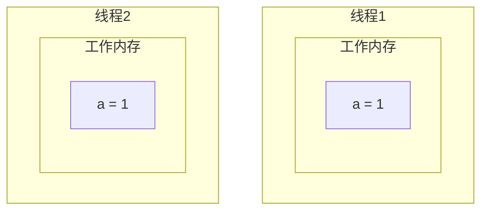

# Java面试经验总结

## 1. Java内存模型
1. Java内存模型定义程序中各个变量的访问规则。即：在JVM中将变量存入内存和将变量从内存取出的底层细节。
站在编程人员角度来看，JMM规定了不同线程如何以及何时能够看到其它线程写入共享变量的值，以及如何同步对共享变量访问。

```mermaid
graph TB;
    subgraph a[线程1]
        subgraph a1[工作内存]
            A[a = 1]
        end
    end
    

    subgraph b[线程2]
        subgraph b1[工作内存]
            B[a = 1]
        end
    end

```

$$
a = v_5
$$
