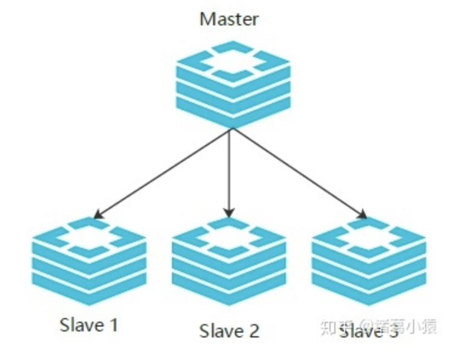

# Java面试经验总结

## 1 Java内存模型
1. Java内存模型定义程序中各个变量的访问规则。即：在JVM中将变量存入内存和将变量从内存取出的底层细节。
站在编程人员角度来看，JMM规定了不同线程如何以及何时能够看到其它线程写入共享变量的值，以及如何同步对共享变量访问。

2. 线程的特性
原子性,有序性,可见性  
其中`synchronized`关键字能保证以上三种特性, `volatile`关键字只能保证 有序性和可见性, 原子性需要靠额外的加锁实现.

4. synchronized底层实现原理
搞清楚`synchronized`底层实现原理之前, 需要先明白Java对象的组成, 一个Java对象实例由三部分组成: ①对象头②实例数据③对齐填充. 其中在**对象头**的mark word字段中存储了锁的状态(无锁,偏向锁,轻量级锁,重量级锁). 每一个锁都对应一个monitor对象

5. Error和Exception区别及联系，可检查异常和不可检查异常
**答**：首先`Error`和`Exception`都是`Throwable`的子类，`Error`通常是JVM出现的错误，例如：OutofMemoryError, StackOverFlowError, ClassNotDefError等，Error错误级别比较严重，出现之后java程序一般就退出了，这些错误是不受检查异常，非代码性错误，因此应用程序也不应该去处理这些错误。
`Exception`是程序本身可以处理的异常，其又分为运行时异常和编译时异常。

## 2 Kafka如何保证“可靠性”和“一致性”
#### 2.1 可靠性
* 生产者数据不会丢失
Kafka有ACK机制，生产者往kafka队列中发送数据的时候，每次发送都有一个确认反馈机制，确保消息能够被正常收到。关于ACK的细节：  
  - **acks = 0**: 意味着如果生产者能够通过网络把消息发送出去，那么就认为消息成功写入到了Kafka。这种情况下还是有可能发生错误，比如发送的数据不能被反序列化，这种模式下运行速度是非常快的。
  - **acks = 1**: 意味着如果Leader接收到消息并把它成功写入到分区文件中（不一同步到磁盘上）时会发送确认或者错误响应。在这个模式下，如果Leader挂了，正在发生新的Leader选举，生产者会收到一个`LeaderNotAvailableException`, 这就需要生产者恰当的处理这个异常重发数据来保证数据不丢失。其次，如果follower从leader中同步数据之前，leader挂了，这时还有可能会发生数据丢失，因为副本（Replica)中还没有来得及从Leader中同步最新的数据。
  - **acks = all(和request.required.acks = -1含义一样)**：Leader在返回确认或者错误响应之前，会等待所有Replica都收到消息。可以再和min.insync.replicas参数结合起来使用，就可以决定在返回确认之前至少几个副本能够收到消息，生产者会一直重试知道消息被成功提交，这种方式比较慢，因为生产者继续发送其它消息之前要等待所有副本都接收到当前的消息。

由此可见，需要根据实际情况来设置不同的acks，既能够保证性能又能保证数据的可靠性。

* 消费者数据不会丢失
消费者通过offset和commit来保证数据不丢失，如果不指定则默认是从latest标识位进行数据消费。kafka记录了每次消费的offset值，下次消费的时候接着上次的offset进行消费

* 保存的数据不会丢失
Kafka按照分区保存数据，每个分区有多个副本（默认3个），副本中其中一个是Leader，剩余的是Follower，Follower会定期从Leader中同步数据，当Leader挂了之后，消费者还能从Follower中继续读取到数据，这需要一个HighWater机制保证的。具体工作原理：  
每个分区的Leader会维护一个ISR列表，ISR列表中就是follower的broker编号，只有跟得上leader的follower副本才能够被加入到ISR列表中。只有所有ISR列表都同步的数据才能被consumer读取。

#### 2.2 一致性
这里的数据一致性是无论是老的Leader还是新选举出来的Leader，consumer读取到的数据均是一样的。Kafka是通过High Water mark机制保证的，如下图所示：

假设分区的副本数是3，replica0 是leader，replica1和replica2是follower，并且都在ISR列表里面。虽然replica0已经写入了message4，但是consumer只能读取到message2，因为所有的ISR都同步了message2，只有high water mark以上的数据才能够被consumer读取到。这样做的原因是Kafka任务还没有被足够多的副本复制的数据都是不安全的。如果consumer读取了leader中的message4，此时leader发生崩溃，replica1

## 3 Kafka如何保证“高性能”和“高吞吐”
1. 页缓存技术 + 磁盘顺序读写 + 零拷贝技术
> 生产者一端

Kafka是基于操作系统的页缓存来实现文件写入的。操作系统本身有一层缓存，叫做page cache, 是在内存里的缓存，也可以称之为os cache，在写入磁盘文件的时候，可以直接写入到这个os cache里，接下来由操作系统决定什么时候把缓存中的数据刷新到磁盘文件中。其次Kafka写入数据仅仅是将数据追加到文件末尾，而不是在文件的随机位置来修改数据，这就保证了写入方式是顺序写入的。**基于以上两点，Kafka就实现了写入数据的超高性能及吞吐量**。

>消费者一端

下面再来考虑消费者这一端，消费的时候实际上是从Kafka的磁盘文件中读取数据，然后发送给下游的消费者。如多读取消费的数据不在os cache 里面，则先从磁盘中读取，然后写入到os cache里面，接着从os cache中将数据拷贝到进程的内存空间中，再从进程缓存空间中将数据拷贝到socket缓存中，最后从socket缓存中提取数据发送到网卡，从网卡发送到下游消费者。其实①从os cache缓存中拷贝到用户进程的内存空间和②从用户进程内存空间拷贝到socket缓存中 这两次拷贝是没必要的, 而且为了这两次拷贝, 操作系统还发生了好几次上下文切换(核心态和用户态的切换), 这种读取数据的方式是非常消耗性能的. kafka为了解决这个问题, 引入了零拷贝技术, 直接从os cache中将数据拷贝到网卡，跳过了从os cache拷贝到用户进程缓存区 和 从用户进程缓存区拷贝到socket缓存，socket缓存中仅仅会拷贝一个描述符过去，不会拷贝数据到socket缓存。这个过程大大提升了消费时对文件数据的读取性能。

如果Kafka集群经过良好的调优，其实会发现大量的数据都是直接写入os cache中，然后读取数据也是从os cache中读取的，相当于是Kafka完全基于内存提供数据的读和写，所以整体性能极高。

> 最后总结

通过上面介绍的 **生产者一端写入数据** 和 **消费者一端读取数据** Kafka所采取的思路可以看出，为什么Kafka能够具备这么高的性能，达到每秒几十万的吞吐量

## 4 gRPC服务降级、熔断、限流容灾技术
>1.服务降级：系统有限资源的合理协调

**概念**：服务降级一般是在服务器负载过大，根据业务的使用情况对某些请求做不处理（直接return）或者简单处理的方式来减轻服务器的负载，从而释放服务器资源来保证核心业务不受影响的技术。
**原因**：服务器的硬件资源是有限的，而用户的请求是无限的，如果短时间内大量用户集中的请求，会导致服务器资源瞬间消耗殆尽，严重时会导致宕机，最终以至于一些重要的服务都不可用。故高峰期保证核心服务的正常可用型，会使用”保大舍小“的方式，拒绝为非核心服务分配系统计算资源的方式，即：服务降级，来保证核心功能的可用性。
**需要考虑的问题**: ①区分核心服务和非核心服务;②自动降级?还是手动降级?③降级后给用户友好提示.

>2.服务熔断: 应对雪崩效应的链路自我保护机制, 可以看成是服务降级的特殊情况

**概念**: 微服务之间的数据互通是通过服务远程调用实现的, 例如服务A调用服务B, 服务B调用服务C; 某一时间对C的调用过多导致C崩溃了, 导致B中堆积了大量请求, 最终B也崩溃了, 继而引发A也崩溃, 导致雪崩式效应. **服务熔断机制就是检测到链路的某个服务不可用, 快速返回相应的错误信息, 当检测到该节点的服务恢复正常时再返回调用**. 在Spring Cloud中通常使用Hystrix组件实现服务熔断.

>3.限流

通过微服务的配置中心或者注册中心实现. 

>4.RPC有哪些组件?

## 5 Redis相关技术

> 1. Redis的持久化机制

Redis支持RDB(Redis DataBase)持久化方式和 AOF持久化方式.  
1) RDB: 用数据集快照的方式记录Redis数据库所有的键值对, 在某个时间点将数据写入文件dump.rdb中, 完成对数据的持久化.  
   **优点**:
   ①只有一个dump.rdb文件, 方便持久化;
   ②容灾性好, 一个文件可以保存到安全的磁盘上;
   ③性能最大化, 持久化是通过fork一个子进程完成写操作, 主进程继续处理其它的命令, 确保了主进程不会进行任何IO操作, 保证了Redis的高性能.
   ④相对于数据集大的情况下, 比AOF启动时性能更高.
   **缺点**:
   ①数据完全性不好. RDB是隔一段时间持久化一次, 中间间隔期间内数据有可能会丢失.
2) AOF(Append-only File): 所有的命令行记录以Redis命令请求的格式保存为aof文件.  
  **优点**:
  ①数据安全, aof可以配置每执行一次命令就记录一次操作到aof文件中.
  ②AOF机制的rewrite模式, 文件过大时会对命令行进行合并重写.
  **缺点**:
  ①AOF文件比rdb文件大, 且数据恢复速度慢
  ②数据集大的时候比rdb启动慢.

> 2. Redis String数据类型支持最大存储大小是多少?

512MB

> 3. Redis高可用-HA机制

所谓的高可用，也叫HA（High Availability），是分布式系统架构设计中必须考虑的因素之一，它通常是指，通过设计减少系统不能提供服务的时间。redis高可用的三种模式：**主从模式，哨兵模式，集群模式**。
  - **主从复制**
  redis多机器部署时，这些机器节点会被分成两类，一类是主节点（master节点），一类是从节点（slave节点）。一般主节点可以进行读、写操作，而从节点只能进行读操作。同时由于主节点可以写，数据会发生变化，当主节点的数据发生变化时，会将变化的数据同步给从节点，这样从节点的数据就可以和主节点的数据保持一致了。一个主节点可以有多个从节点，但是一个从节点会只会有一个主节点，也就是所谓的一主多从结构。
  
  **主从模式的优点：**
    1. 支持主从复制，主机会自动将数据同步到从机，可以进行读写分离;
    2. 为了分载Master的读操作压力，Slave服务器可以为客户端提供只读操作的服务，写服务依然必须由Master来完成;
    3. Slave同样可以接受其他Slaves的连接和同步请求，这样可以有效地分载Master的同步压力;
    4. Master是以非阻塞的方式为Slaves提供服务。所以在Master-Slave同步期间，客户端仍然可以提交查询或修改请求;
    5. Slave同样是以阻塞的方式完成数据同步。在同步期间，如果有客户端提交查询请求，Redis则返回同步之前的数据。  
    
    **主从模式缺点：**
    1.  Redis不具备自动容错和恢复功能，主机从机的宕机都会导致前端部分读写请求失败，需要等待机器重启或者手动切换前端的IP才能恢复;
    2.  主机宕机，宕机前有部分数据未能及时同步到从机，切换IP后还会引入数据不一致的问题，降低了系统的可用性;
    3.  如果多个Slave断线了，需要重启的时候，尽量不要在同一时间段进行重启。因为只要Slave启动，就会发送sync请求和主机全量同步，当多个Slave重启的时候，可能会导致Master IO剧增从而宕机。
    4.  Redis较难支持在线扩容，在集群容量达到上限时在线扩容会变得很复杂;
    5.  redis的主节点和从节点中的数据是一样的，降低的内存的可用性
  
  - **哨兵模式**
    1. 每个Sentinel（哨兵）进程以每秒钟一次的频率向整个集群中的Master主服务器，Slave从服务器以及其他Sentinel（哨兵）进程发送一个 PING 命令。
    2. 如果一个实例（instance）距离最后一次有效回复 PING 命令的时间超过 down-after-milliseconds 选项所指定的值， 则这个实例会被 Sentinel（哨兵）进程标记为主观下线（SDOWN）
    3. 如果一个Master主服务器被标记为主观下线（SDOWN），则正在监视这个Master主服务器的所有 Sentinel（哨兵）进程要以每秒一次的频率确认Master主服务器的确进入了主观下线状态
    4. 当有足够数量的 Sentinel（哨兵）进程（大于等于配置文件指定的值）在指定的时间范围内确认Master主服务器进入了主观下线状态（SDOWN）， 则Master主服务器会被标记为客观下线（ODOWN）
    5. 在一般情况下， 每个 Sentinel（哨兵）进程会以每 10 秒一次的频率向集群中的所有Master主服务器、Slave从服务器发送 INFO 命令。
    6. 当Master主服务器被 Sentinel（哨兵）进程标记为客观下线（ODOWN）时，Sentinel（哨兵）进程向下线的 Master主服务器的所有 Slave从服务器发送 INFO 命令的频率会从 10 秒一次改为每秒一次。
    7. 若没有足够数量的 Sentinel（哨兵）进程同意 Master主服务器下线， Master主服务器的客观下线状态就会被移除。若 Master主服务器重新向 Sentinel（哨兵）进程发送 PING 命令返回有效回复，Master主服务器的主观下线状态就会被移除。
  - **集群模式**

## 6 框架相关技术

> 1. Spring Bean的生命周期

Spring Bean的生命周期可以概括为4个阶段：①bean的实例化. 通过反射的方式创建bean实例; ②属性赋值; ③初始化, 调用init函数; ④销毁.  
在①实例化之前和之后可以引入一些后置处理器:`InstantiationAwareBeanPostProcessor`, 包括`postProcessBeforeInstantiation`和`postProcessAfterInstantiation`.  
在③属性初始化之前和之后可以引入`BeanPostProcessor`, 包括`postProcessBeforeInitialization`和`postProcessAfterInitialization`.  

